# Mobile Application Development (MAD) Experiments 🚀


A comprehensive collection of Android and Flutter experiments showcasing various mobile development concepts, architectures, and integrations.

## 🎯 Project Overview

This repository contains 10 experiments covering different aspects of mobile application development, from basic UI components to advanced AR implementations.

## 🧪 Experiments

### Experiment 1: Basic Android UI with Jetpack Compose


**Objective:** Introduction to modern Android UI development using Jetpack Compose.

**Key Technologies:**
- Jetpack Compose
- Material Design 3
- Kotlin Coroutines

**Output:**
| Basic UI Implementation |
|:----------------------:|
| 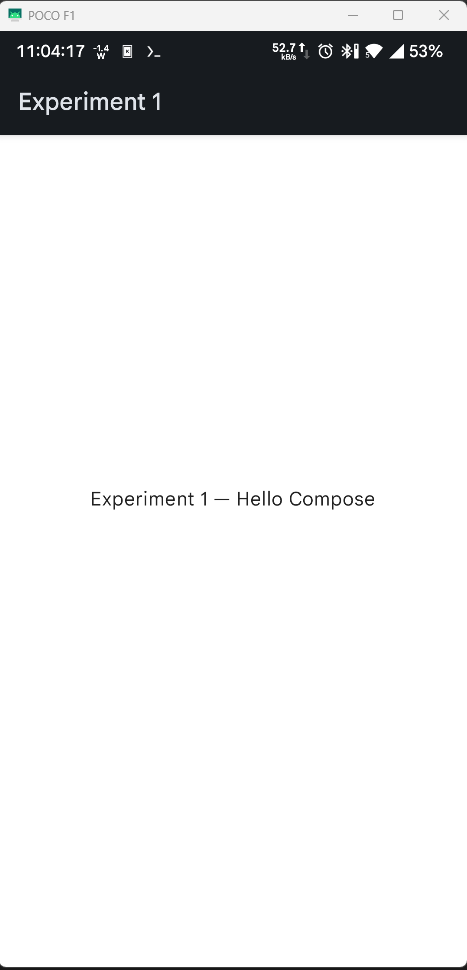 |

### Experiment 2: Flutter Widget Fundamentals


**Objective:** Understanding Flutter widget hierarchy and state management.

**Key Technologies:**
- Flutter Widgets
- Provider State Management
- Material Components

**Output:**
| Main Screen | Widget Demonstrations |
|:-----------:|:-------------------:|
| 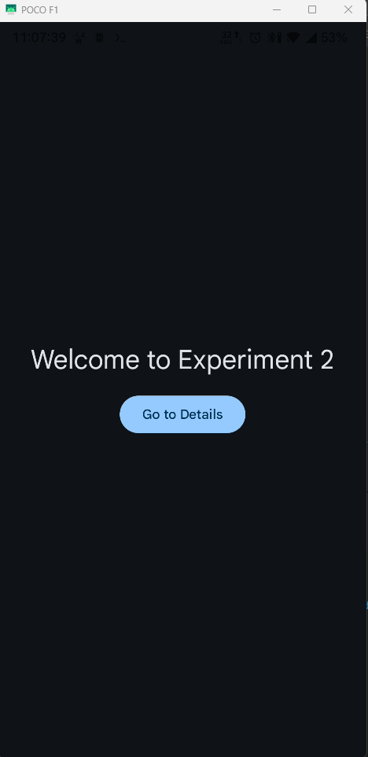 | 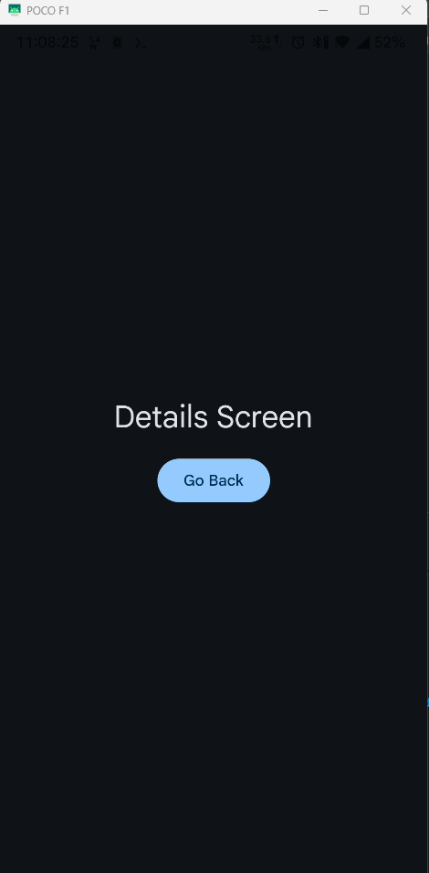 |

### Experiment 3: Database Integration


**Objective:** Implementation of local database operations using Room and SQLite.

**Key Technologies:**
- Room Database
- Kotlin Flow
- LiveData
- Data Access Objects (DAO)

**Output:**
| Database Setup | CRUD Operations | Data Display | Query Results |
|:-------------:|:--------------:|:------------:|:-------------:|
| 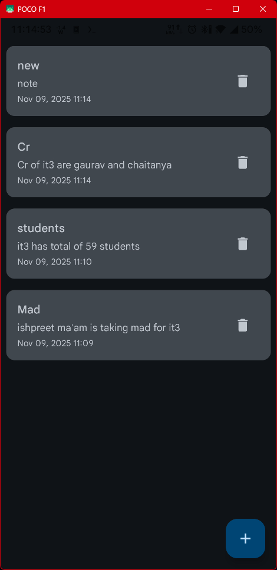 |  | 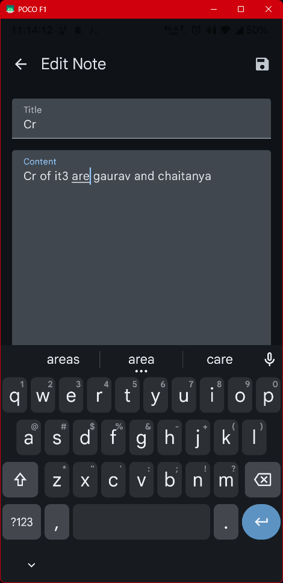 | 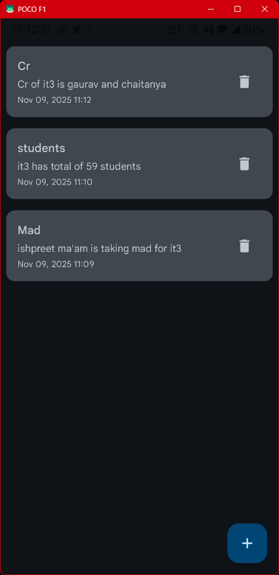 |

### Experiment 4: Weather API Integration


**Objective:** Working with REST APIs and handling network operations.

**Key Technologies:**
- Retrofit
- OkHttp
- JSON parsing
- API Integration
- MVVM Architecture

**Output:**
| API Integration | Data Fetching | Response Display |
|:--------------:|:-------------:|:----------------:|
| 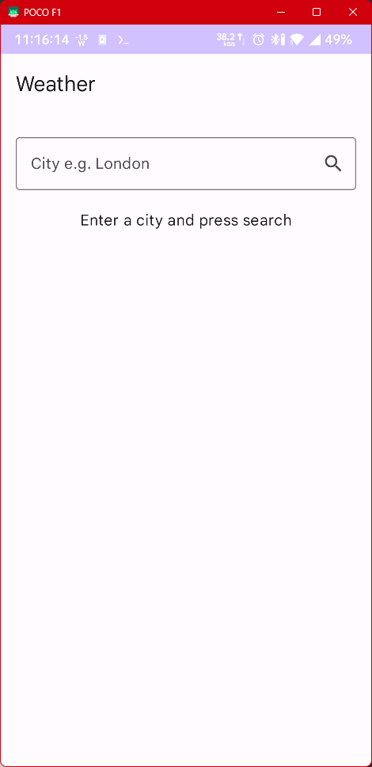 | 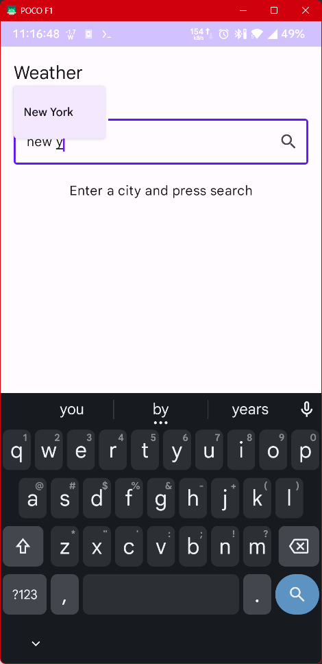 | 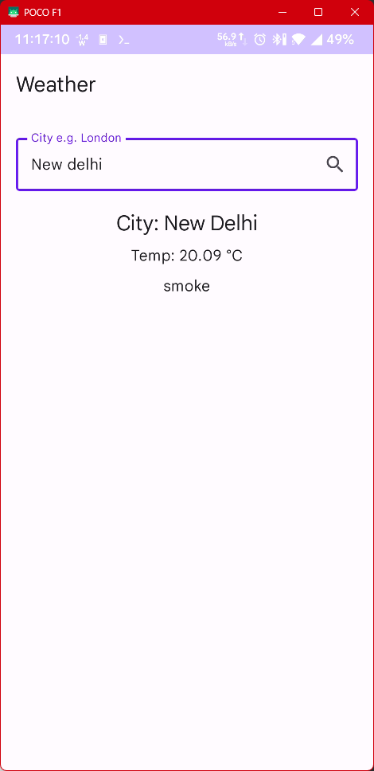 |

### Experiment 5: Location-Based Services


**Objective:** Implementing location services and map integrations.

**Key Technologies:**
- Google Maps SDK
- Geolocation
- Location Services
- Permission Handling

**Output:**
| Maps Integration | Location Services |
|:---------------:|:----------------:|
| 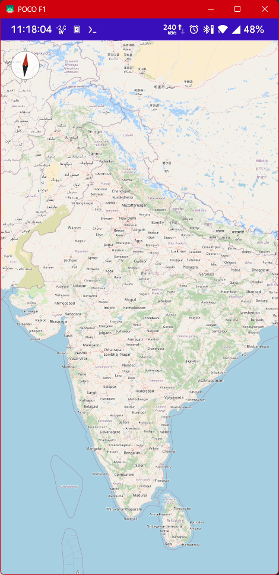 | 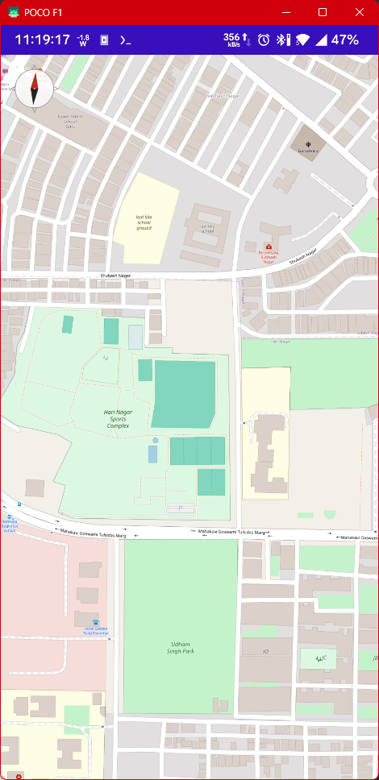 |

### Experiment 6: Form Validation & State Management


**Objective:** Advanced form handling and state management using BLoC pattern.

**Key Technologies:**
- Flutter BLoC
- Form Validation
- Reactive Programming
- Stream Controllers

**Output:**
| Form UI | Validation | State Management |
|:-------:|:----------:|:----------------:|
| 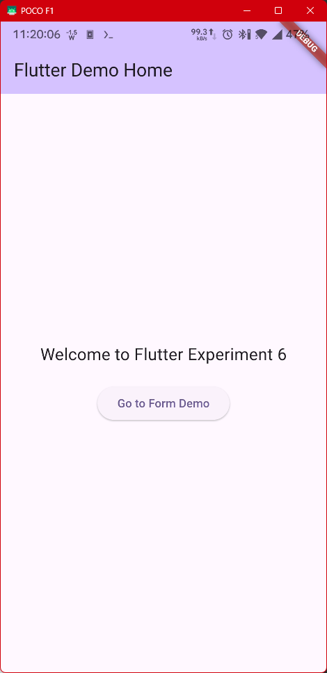 |  | 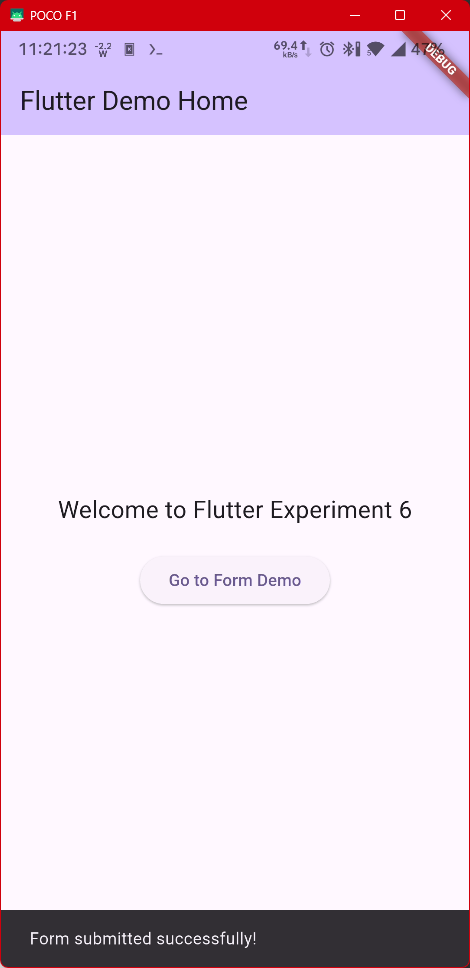 |

### Experiment 7: HackerNews Application with Testing


**Objective:** Building a HackerNews client with comprehensive testing implementation.

**Key Technologies:**
- Unit Testing with JUnit
- Integration Testing with Espresso
- Widget Testing
- Mock Testing
- HackerNews API Integration
- Error Handling

**Output:**
| News List | Story Details |
|:---------:|:------------:|
| 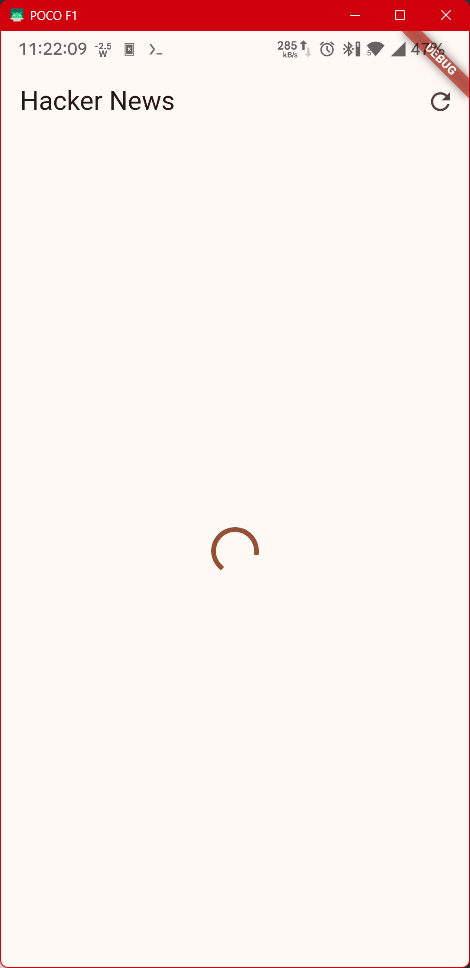 | 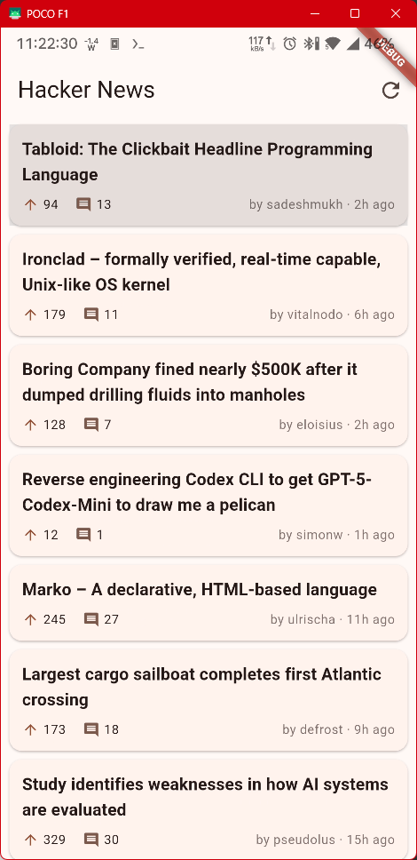 |

### Experiment 8: App Deployment and Optimization


**Objective:** Deploying the HackerNews application to Google Play Store and implementing performance optimizations.

**Key Technologies:**
- App Bundle Generation
- ProGuard Configuration
- Performance Profiling
- Memory Leak Detection
- Play Store Deployment
- CI/CD Pipeline

*Note: This experiment focuses on the deployment and optimization of the HackerNews application developed in Experiment 7.*

**Output:**
| App Bundle Generation | Performance Profiling |
|:--------------------:|:--------------------:|
| 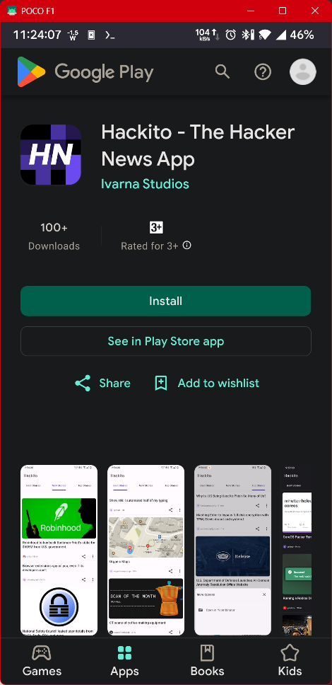 | 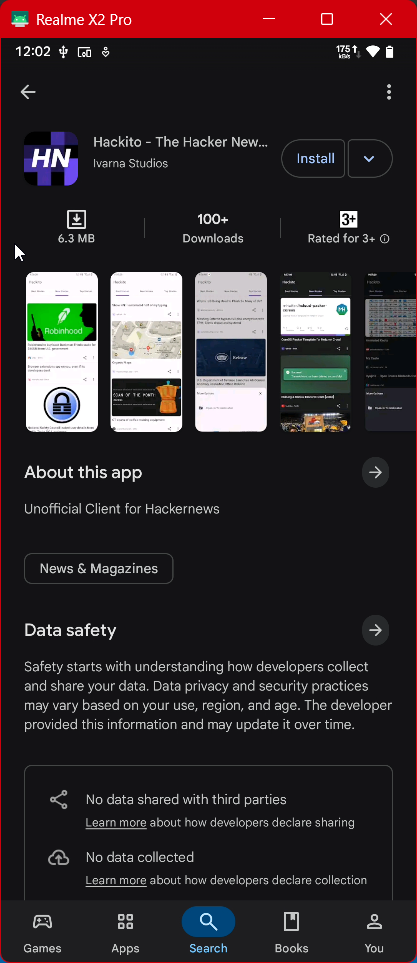 |


**Objective:** Implementing social media authentication and sharing features.

**Key Technologies:**
- OAuth 2.0
- Social Media SDKs
- Firebase Auth
- Deep Linking

### Experiment 9: AR Scene Viewer


**Objective:** Implementation of Augmented Reality features using SceneView.

**Key Technologies:**
- SceneView
- ARCore
- 3D Model Rendering
- Camera Integration

**Output:**
| AR Setup | Model Placement | AR Interaction | Scene View |
|:--------:|:--------------:|:--------------:|:----------:|
| 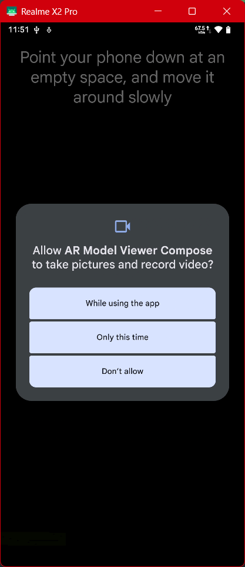 | 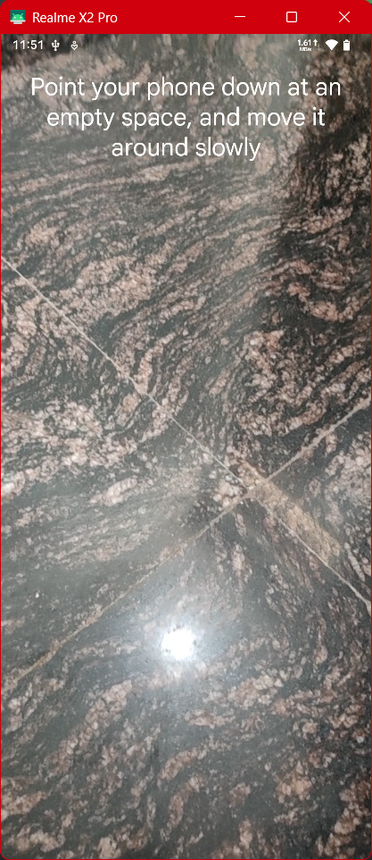 | 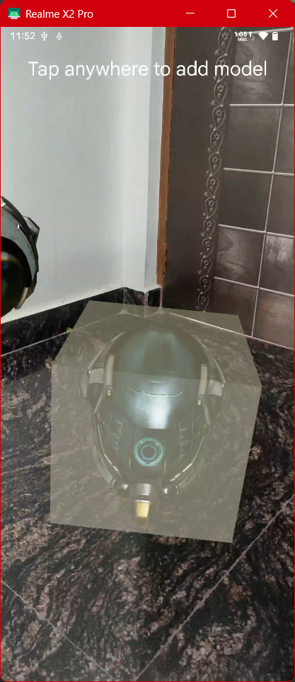 | 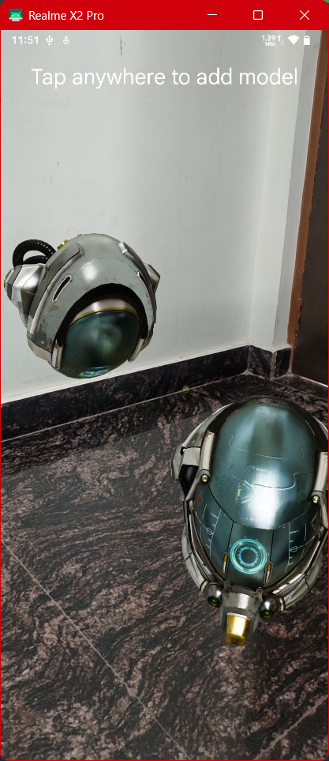 |

### Experiment 10: IoT Dashboard


**Objective:** Creating an IoT dashboard with real-time data visualization.

**Key Technologies:**
- MQTT Protocol
- Real-time Data
- Charts and Graphs
- Device Management


## 🛠 Technology Stack

### Core Technologies
- Kotlin & Dart Programming Languages
- Android SDK & Flutter Framework
- Jetpack Compose & Flutter Widgets
- Material Design Components

### Architecture & Patterns
- MVVM (Model-View-ViewModel)
- Clean Architecture
- Repository Pattern
- Dependency Injection

### Data Management
- Room Database
- SharedPreferences
- SQLite
- Firebase

### Networking
- Retrofit
- OkHttp
- REST APIs
- WebSockets

### Testing
- JUnit
- Flutter Test
- Mockito
- Integration Tests

## 📱 Screenshots

<table>
  <tr>
    <td>Experiment 1</td>
    <td>Experiment 4</td>
    <td>Experiment 9</td>
  </tr>
  <tr>
    <td></td>
    <td></td>
    <td></td>
  </tr>
</table>

## 🚀 Getting Started

1. Clone the repository
```bash
git clone https://github.com/abhay-byte/mad.git
```

2. Navigate to any experiment
```bash
cd experiment_X
```

3. Install dependencies
```bash
# For Flutter projects
flutter pub get

# For Android projects
./gradlew build
```

4. Run the application
```bash
# For Flutter projects
flutter run

# For Android projects
./gradlew installDebug
```

## 📖 Documentation

Each experiment contains its own README.md with:
- Detailed objectives
- Implementation details
- Setup instructions
- Usage examples
- Screenshots

## 🤝 Contributing

Contributions are welcome! Please feel free to submit a Pull Request.

## 📄 License

This project is licensed under the MIT License - see the [LICENSE](LICENSE) file for details.

## 🙏 Acknowledgments

- [Android Documentation](https://developer.android.com/)
- [Flutter Documentation](https://flutter.dev/docs)
- [Material Design Guidelines](https://material.io/design)
- [SceneView Android](https://github.com/SceneView/sceneview-android)
- Various open-source libraries and their contributors

---

<p align="center">
Made with ❤️ by Abhay
</p>