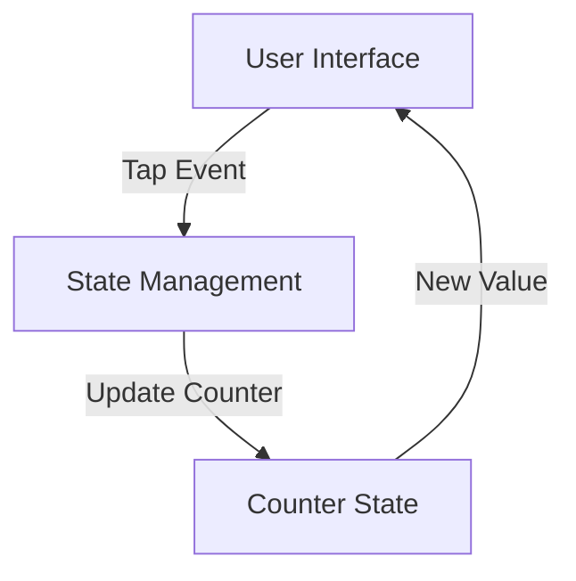

# Experiment 10: IoT Integration with Flutter

## Phase 1: System Architecture & Design

### Architecture
- Using Flutter BLoC pattern for state management
- MQTT protocol for IoT device communication
- Clean architecture with separation of concerns:
  * Presentation Layer (UI)
  * Business Logic Layer (BLoC)
  * Data Layer (MQTT Client & Device Repository)

### Features
1. Connect to MQTT broker
2. Display device status
3. Control virtual IoT devices:
   - Toggle LED state (ON/OFF)
   - Read temperature sensor value
   - Display connection status
4. Real-time updates using MQTT subscriptions

### Data Flow Diagram

## Phase 2: UI Scaffolding
- Create main.dart with MaterialApp setup
- Implement basic app theme
- Create home screen with app bar and body
- Add counter display widget
- Add button row with increment/decrement buttons

## Phase 3: State Management and Logic
- Implement counter state management
- Add increment/decrement logic
- Add reset functionality
- Implement basic animations

## Phase 4: Testing and Polish
- Add basic widget tests
- Add unit tests for counter logic
- Polish UI with proper spacing and typography
- Add app icon