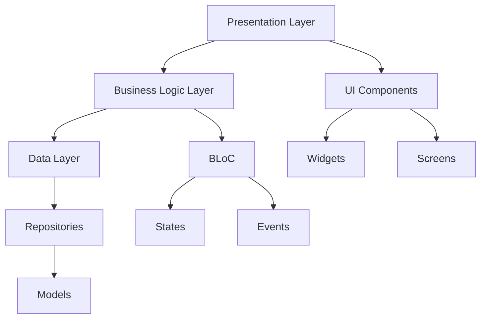

# Flutter Cross-Platform Development - Experiment 6

## Phase 1: System Architecture & Design

### Core Architecture
- Clean Architecture with separation of concerns
- BLoC (Business Logic Component) pattern for state management
- Repository pattern for data handling

### Component Design

### Feature List
1. **Basic Features**
   - Responsive UI layout
   - Navigation between multiple screens
   - Form handling with validation
   - List view with custom items
   - State management demonstration

2. **Advanced Features** (To be implemented based on progress)
   - Theme switching (Light/Dark mode)
   - Local data persistence
   - Animations
   - Platform-specific adaptations

## Phase 2: Project Setup and Basic Structure
- Initialize Flutter project
- Configure dependencies in pubspec.yaml
- Set up folder structure
- Create base theme configuration
- Implement main app widget

## Phase 3: Core Feature Implementation
- Create basic UI components
- Implement navigation system
- Set up BLoC pattern
- Create main screens
- Implement form handling

## Phase 4: State Management and Data Flow
- Implement BLoC logic
- Create repositories
- Add data models
- Connect UI with BLoC
- Implement form validation

## Phase 5: Testing and Optimization
- Write widget tests
- Add unit tests for BLoC
- Perform integration testing
- Optimize performance
- Handle platform-specific differences