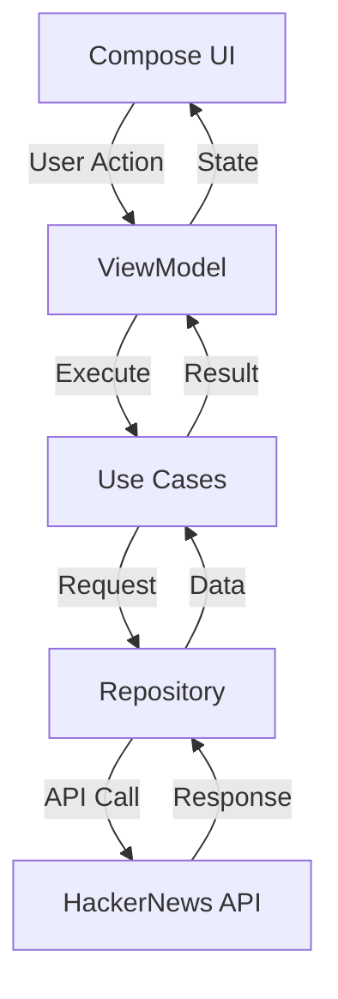
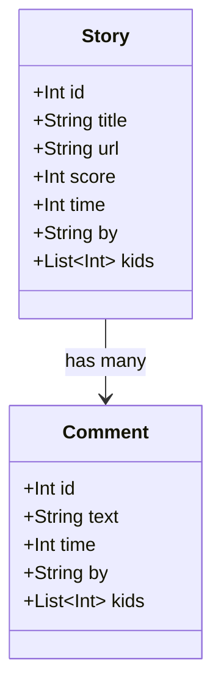

# TODO List for Experiment 7: HackerNews App with Testing

## Phase 1: System Architecture & Design

### Architecture
- **Pattern:** MVVM (Model-View-ViewModel) with Clean Architecture
  - **UI Layer:** Compose UI + ViewModels
  - **Domain Layer:** Use Cases
  - **Data Layer:** Repository + Data Sources

### Data Flow Diagram

### Entity Relationship Diagram

### Features to Implement
1. View top stories list
2. View story details
3. View comments (basic implementation)
4. Error handling
5. Loading states
6. Pull-to-refresh

## Phase 2: Project Setup & Base Implementation
- [ ] Initialize new Flutter project
- [ ] Set up project structure following clean architecture
- [ ] Configure dependencies in pubspec.yaml
- [ ] Implement basic data models
- [ ] Set up API client for HackerNews
- [ ] Create repository interface and implementation
- [ ] Implement network error handling

## Phase 3: UI Implementation
- [ ] Create top stories list screen
- [ ] Implement story detail screen
- [ ] Add loading indicators
- [ ] Implement error states
- [ ] Add pull-to-refresh functionality
- [ ] Create basic comment display

## Phase 4: Testing Implementation
- [ ] Unit Tests
  - [ ] Repository tests
  - [ ] Use case tests
  - [ ] ViewModel tests
  - [ ] API response parsing tests
  
- [ ] Widget Tests
  - [ ] Story list screen tests
  - [ ] Story detail screen tests
  - [ ] Error state tests
  - [ ] Loading state tests

- [ ] Integration Tests
  - [ ] End-to-end flow tests
  - [ ] Navigation tests
  - [ ] API integration tests

## Phase 5: Debugging & Documentation
- [ ] Implement comprehensive error logging
- [ ] Add performance monitoring
- [ ] Create debugging utilities
- [ ] Write documentation
  - [ ] Setup instructions
  - [ ] Testing guide
  - [ ] API documentation
  - [ ] Bug tracking guide