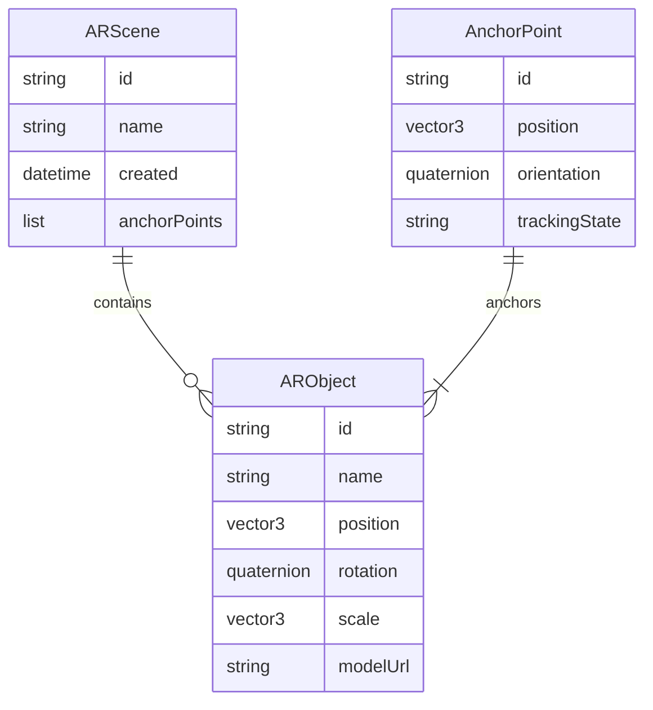
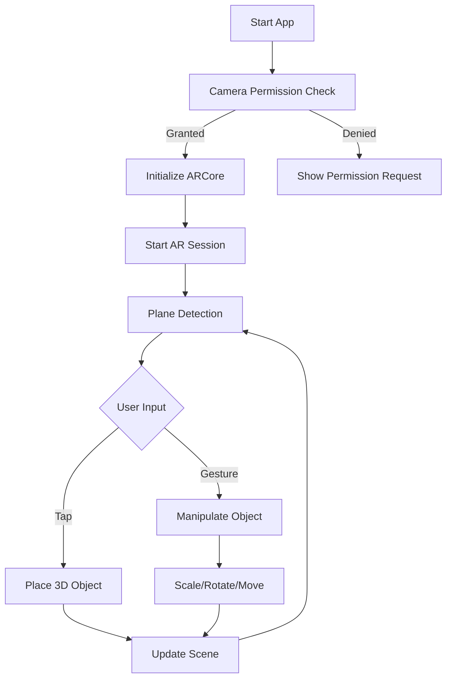
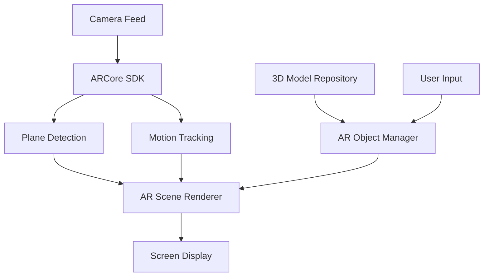

# Experiment 9: AR Integration TODO List

## Phase 1: System Architecture & Design ✅
- [x] MVVM Architecture defined
- [x] Clean Architecture layers established
- [x] Component diagrams created
- [x] Data flow planned

### ERD Diagram

### Flowchart

### Data Flow Diagram

## Features to Implement

1. Basic AR Features ✅
   - [x] Camera permission handling
   - [x] AR session management
   - [x] Plane detection and visualization
   - [x] Light estimation

2. Object Manipulation ✅
   - [x] 3D object placement
   - [x] Object scaling
   - [x] Object rotation
   - [x] Object translation

3. User Interface ✅
   - [x] AR overlay controls
   - [x] Object selection menu
   - [x] Gesture controls
   - [x] Visual feedback for interactions

4. Asset Management ✅
   - [x] 3D model loading
   - [x] Texture management
   - [x] Model optimization

5. Advanced AR Features ✅
   - [x] Cloud Anchors for shared AR experiences
   - [x] Augmented Image tracking
   - [x] Point Cloud visualization
   - [x] Advanced camera manipulator
   - [x] HDR environment lighting
   - [x] glTF camera support

## Implementation Phases

### Phase 2: Basic Setup and ARCore Integration ✅
- [x] Initialize Android project with ARCore dependencies
- [x] Set up camera permissions
- [x] Create basic AR activity
- [x] Implement AR session management

### Phase 3: AR Foundation Layer ✅
- [x] Implement plane detection
- [x] Add surface visualization
- [x] Setup light estimation
- [x] Create anchor management system

### Phase 4: Object Management ✅
- [x] Create 3D object repository
- [x] Implement object placement logic
- [x] Add basic transformation controls
- [x] Setup object persistence

### Phase 5: User Interface and Interaction ✅
- [x] Design and implement AR UI overlay
- [x] Add gesture recognition
- [x] Implement object manipulation controls
- [x] Add visual feedback systems

### Phase 6: Testing and Optimization ✅
- [x] Unit test core components
- [x] Integration tests for AR features
- [x] Performance optimization
- [x] Memory management improvements

### Phase 7: Advanced AR Features Integration 🔄
- [x] Cloud Anchors integration
  - [x] Setup cloud anchor hosting
  - [x] Implement anchor resolution
  - [x] Add shared experience support
- [x] Image Tracking
  - [x] Add image database
  - [x] Implement image detection
  - [x] Handle tracked image updates
- [x] Point Cloud Visualization
  - [x] Implement point cloud rendering
  - [x] Add confidence filtering
  - [x] Add point cloud management
- [x] Camera and Environment
  - [x] Implement HDR environment mapping
  - [x] Add glTF camera support
  - [x] Create advanced camera manipulator