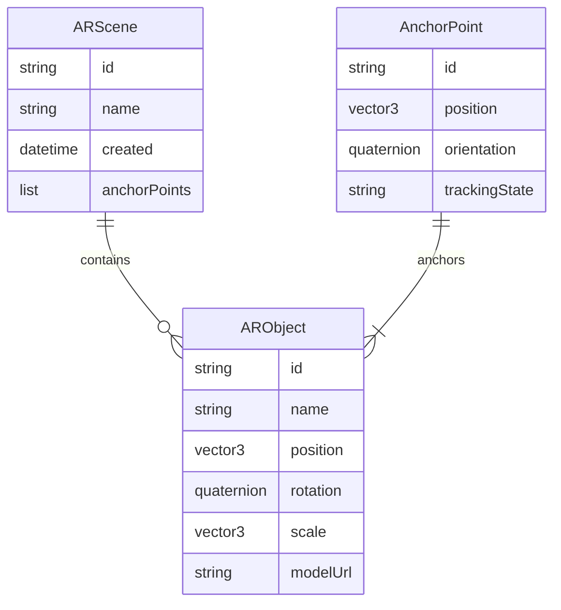
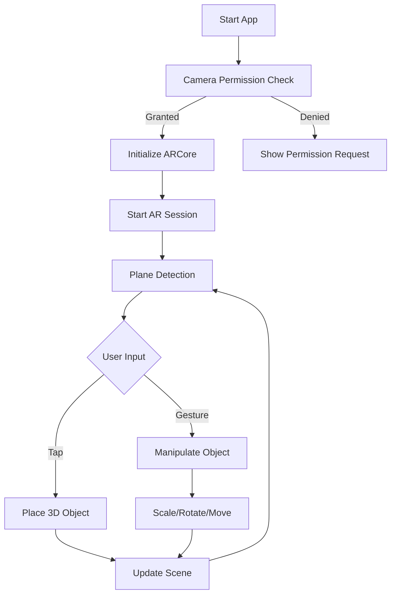
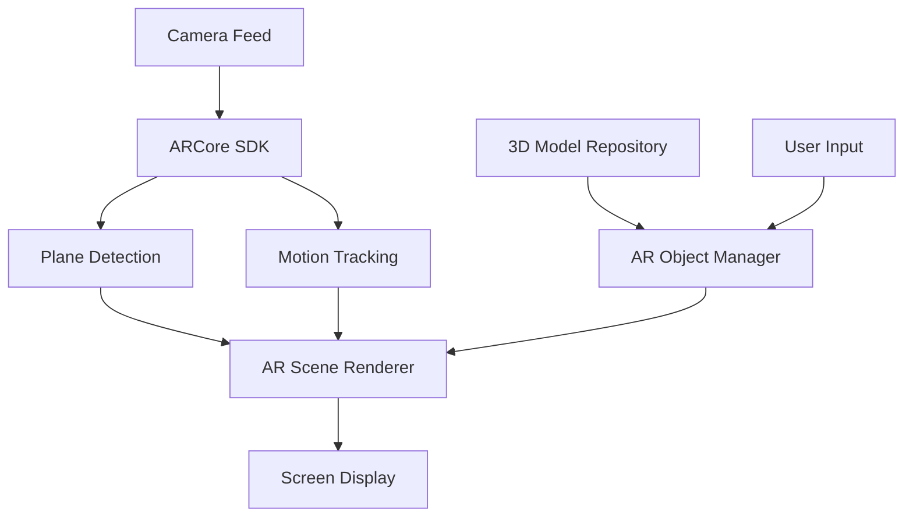

# Experiment 9: AR Integration TODO List

## Phase 1: System Architecture & Design

### Architecture
- MVVM (Model-View-ViewModel) architecture will be used
- ARCore integration for AR features
- Clean Architecture principles with clear separation of concerns

### ERD Diagram

### Flowchart

### Data Flow Diagram

## Features to Implement

1. Basic AR Features
   - Camera permission handling
   - AR session management
   - Plane detection and visualization
   - Light estimation

2. Object Manipulation
   - 3D object placement
   - Object scaling
   - Object rotation
   - Object translation

3. User Interface
   - AR overlay controls
   - Object selection menu
   - Gesture controls
   - Visual feedback for interactions

4. Asset Management
   - 3D model loading
   - Texture management
   - Model optimization

## Implementation Phases

### Phase 2: Basic Setup and ARCore Integration
- Initialize Android project with ARCore dependencies
- Set up camera permissions
- Create basic AR activity
- Implement AR session management

### Phase 3: AR Foundation Layer
- Implement plane detection
- Add surface visualization
- Setup light estimation
- Create anchor management system

### Phase 4: Object Management
- Create 3D object repository
- Implement object placement logic
- Add basic transformation controls
- Setup object persistence

### Phase 5: User Interface and Interaction
- Design and implement AR UI overlay
- Add gesture recognition
- Implement object manipulation controls
- Add visual feedback systems

### Phase 6: Testing and Optimization
- Unit test core components
- Integration tests for AR features
- Performance optimization
- Memory management improvements